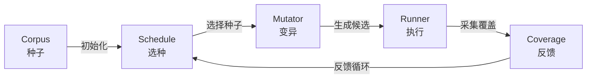

# PJ2 - 模糊测试（Fuzzing）实验报告

## 一、实验信息

- **课程名称**：软件质量保障与测试
- **实验名称**：模糊测试（Fuzzing）
- **实验类型**：课程项目
- **小组成员**：王龄锋、李子涵、肖羽平、朱相成、
- **完成日期**：2026.6.9

### 小组分工

| 成员   | 负责内容                                                     |
| ------ | ------------------------------------------------------------ |
| 王龄锋 | 变异器（`mutator.py`）实现与测试，包含 15 种变异策略         |
| 朱相成 | 路径频率调度（`path_power_schedule.py`）与 `PathGreyBoxFuzzer` 实现 |
| 李子涵 | 新增调度策略（`rare`、`coverage`、`length`）及对比实验脚本   |
| 肖羽平 | 持久化框架与实验编排                                         |
| 洪昭晖 | 代码合并联调、最终结果汇总与实验报告统稿                     |

---

## 二、实验目的

本实验旨在基于给定的简易 fuzzing 框架，完成输入变异、seed 调度、覆盖率反馈与结果持久化等关键能力，理解灰盒模糊测试的基本流程，并在此基础上形成一个可重复运行、可观察、可分析的实验闭环。

---

## 三、项目理解

### 3.1 框架结构

项目主要由以下模块组成：

| 模块       | 路径                      | 功能                                               |
| ---------- | ------------------------- | -------------------------------------------------- |
| `fuzzer`   | `simple_fuzzer/fuzzer/`   | 控制 fuzz 循环、seed 选择与输入生成                |
| `runner`   | `simple_fuzzer/runner/`   | 执行目标样例并返回运行结果与覆盖率                 |
| `schedule` | `simple_fuzzer/schedule/` | 对不同 seed 进行能量分配或优先级判断               |
| `utils`    | `simple_fuzzer/utils/`    | 提供覆盖率追踪、种子封装、对象持久化与输入变异工具 |
| `samples`  | `simple_fuzzer/samples/`  | 提供用于验证 fuzz 效果的 4 个示例程序              |
| `corpus`   | `simple_fuzzer/corpus/`   | 保存每个样例对应的初始语料库种子                   |

### 3.2 设计主线

实验实现围绕以下主线展开：

1. **初始化语料库**：从 `corpus/` 目录读取初始种子。
2. **选择 seed**：通过 `schedule/` 中的调度策略选择更有价值的种子。
3. **执行变异**：通过 `utils/mutator.py` 对输入进行多种策略的随机变异。
4. **运行目标程序并收集覆盖率**：将变异后的输入交给 `runner/` 执行，记录覆盖率与异常。
5. **反馈与持久化**：将新覆盖、新崩溃或高价值 seed 反馈到调度阶段，并持久化中间结果。

整体流程如下图所示：



---

## 四、实现内容

### 4.1 变异器实现

本项目在 `simple_fuzzer/utils/mutator.py` 中实现了 15 种变异策略。`Mutator` 类维护一个变异算子列表，每次调用 `mutate()` 时随机选择一种策略，对当前 seed 生成新的候选输入。

#### 变异策略总览

| 类别               | 策略函数                          | 说明                                                         |
| ------------------ | --------------------------------- | ------------------------------------------------------------ |
| 字符插入           | `insert_random_character`         | 在任意位置插入可打印字符，提高输入长度和字符组合多样性       |
| 字符替换           | `replace_random_character`        | 替换单个字符，保持长度不变，适合探索格式边界                 |
| 字符删除           | `delete_random_character`         | 删除单个字符，触发长度不足或字段缺失类边界                   |
| 块删除             | `delete_random_block`             | 删除一段短文本，模拟结构损坏、标签缺失等情况                 |
| 块复制             | `duplicate_random_block`          | 复制已有片段，制造重复字段、重复标签和长度压力               |
| 结构插入           | `insert_structure_pair`           | 插入括号、引号、花括号、HTML 标签等成对结构                  |
| Token 重复         | `repeat_interesting_token`        | 重复 `FDU`、`LAB`、`%d`、`{Key}` 等高价值 token              |
| Bit Flip           | `flip_random_bits`                | 翻转 1、2、4 个相邻 bit，模拟底层字节扰动                    |
| 字节算术           | `arithmetic_random_bytes`         | 对 1、2、4 个相邻字节做小范围加减，探索数值边界              |
| Interesting Values | `interesting_random_bytes`        | 将局部字节替换为 `0x00`、`0xFF`、整数上下界等边界值          |
| 字典 Token         | `overwrite_with_dictionary_token` | 注入 `FDU`、`FDUPLAB`、`<html>`、`{Key}`、`NaN` 等关键 token |
| 数字 Token         | `mutate_numeric_token`            | 替换或插入 `0`、`-1`、`2147483647`、`NaN`、`inf` 等数值边界  |
| Havoc 插入         | `havoc_random_insert`             | 插入原输入片段或随机可打印字节，扩大随机搜索空间             |
| Havoc 替换         | `havoc_random_replace`            | 将一段内容替换为原输入片段或随机字节                         |
| 块交换             | `random_block_swap`               | 交换两个相邻字节块，在保留局部结构的同时改变顺序             |

#### 面向样例程序的针对性设计

变异器中的字典 token 和数值 token 根据四个样例程序的特点专门设计：

- **sample1**（数值运算）：加入 `0`、`1`、`-1`、`NaN`、`inf`、`1e309`、`2147483647` 等数值边界值，针对 `float()` 转换和算术运算。
- **sample2**（字符串格式化）：加入 `.`、`%d`、`{Key}` 等格式化相关 token，针对 `split(".")` 和 `str.format()` 操作。
- **sample3**（深层嵌套分支）：加入 `FDU`、`FDUPLAB`、`FDUQLAB`、`L`、`LA`、`LAB` 等 token，针对 `s[0]=='F' → s[1]=='D' → s[2]=='U'` 深层分支结构。
- **sample4**（HTML 解析）：加入 `<html>`、`</html>`、`<script>`、`</script>`、`&amp;` 等 HTML 片段，针对 `HTMLParser.feed()`。

#### 边界情况处理

- **空字符串**：删除、替换、bit flip 等不可操作时安全返回原字符串；插入类和字典类仍能生成非空输入。
- **短字符串**：块操作和字节操作自动降级到合法范围，避免越界。
- **非 ASCII 输入**：字节级变异使用 `utf-8` 转字节，变异后使用 `latin-1` 解码，保证任意字节都能映射回 Python 字符串。
- **非字符串输入**：`Mutator.mutate()` 会先转换为 `str`，避免调用方误传数字或其他对象时直接崩溃。
- **可观测性接口**：额外提供 `strategy_names()`、`mutate_with_strategy()` 和 `generate_examples()` 方法，便于统计和展示。

**变异器多样性示例：**


---

### 4.2 调度策略实现

本项目实现了 5 种调度策略，从不同维度决定"哪个 seed 更值得继续变异"。

#### 4.2.1 路径频率调度（`path`）

`PathPowerSchedule` 采用**路径频率逆调度**策略：

1. **路径频率记录**：维护 `path_frequency: Dict[int, int]`，key 为 `hash(frozenset(coverage))`（即覆盖路径的唯一标识），value 为该路径被命中的总次数。
2. **Energy 分配**：`energy = 1.0 / freq`，路径越罕见，energy 越高。
3. **加权选择**：`PowerSchedule.choose()` 根据归一化后的 energy 做加权随机选择，自动将选择概率偏向罕见路径的 seed。

`PathGreyBoxFuzzer` 在每次 `run()` 后调用 `schedule.record_path(coverage)` 更新频率，并维护 `total_paths`、`last_path_time` 等统计量，在运行时输出包含路径信息的统计表。

**为什么路径频率调度优于均匀调度？**

均匀调度中所有 seed 获得相同变异次数，已覆盖的常见路径和新发现的罕见路径被无差别对待，导致算力被大量浪费在"已经探索过的区域"。路径频率调度让罕见路径的 seed 获得更多变异机会，将有限计算资源集中投入在"信息增量更大"的输入上。

**路径调度运行时统计示例：**


#### 4.2.2 新增调度策略

新增 3 种互补策略，与已有 `path` 和基线 `uniform` 形成对比：

##### 覆盖率优先调度（`coverage`）

```python
energy = 1.0 + len(seed.coverage)
```

覆盖更多代码位置的 seed 获得更高 energy。该策略验证"已经触达更多分支的 seed 是否更值得继续变异"。

##### 稀有覆盖调度（`rare`）

```python
energy = Σ 1.0 / location_frequency[location]
```

统计每个覆盖位置在所有执行中的出现频率，给覆盖稀有位置的 seed 更高 energy。与 `path` 不同：`path` 关注整条路径是否常见，`rare` 关注单个代码位置是否少见。

##### 短输入优先调度（`length`）

```python
energy = 1.0 / sqrt(len(seed.data) + 1)
```

更短的 seed 获得更高 energy。使用平方根惩罚而非直接按长度反比，避免长输入权重下降过快。

#### 策略对比总结

| 策略       | 设计维度   | 反馈类型  | 核心思想                    |
| ---------- | ---------- | --------- | --------------------------- |
| `uniform`  | 基线       | 无        | 所有 seed 等概率选择        |
| `path`     | 路径频率   | 运行反馈  | 优先探索低频路径            |
| `coverage` | 覆盖广度   | seed 属性 | 优先选择覆盖位置更多的 seed |
| `rare`     | 覆盖稀有度 | 运行反馈  | 优先选择覆盖稀有位置的 seed |
| `length`   | 执行成本   | seed 属性 | 优先选择短输入以提高吞吐量  |

**多策略对比汇总截图：**


---

### 4.3 持久化与框架优化

为满足"使用 `object_utils` 将 seed 或相关中间结果持久化到文件系统"的要求，项目对持久化方式进行了统一整理。

#### 对象序列化

- `dump_object()` / `load_object()`：基于 `pickle` 保存和读取 Python 对象（`.pkl` 文件）。
- `dump_json()`：将结果保存为 `.json` 文件，便于统计和报告整理。

#### 结果落盘

单次运行结束后输出三类文件：

| 格式    | 用途                                                 |
| ------- | ---------------------------------------------------- |
| `.pkl`  | 保存结构化 `Result` 对象，可被 `view_result.py` 读取 |
| `.json` | 保存可直接统计和展示的结果数据                       |
| `.txt`  | 保存便于快速查看的文本摘要                           |

若启用 `--save-population`，还会额外保存最终 population 快照。

#### 目录管理

统一使用如下结果目录：

```text
_result/
├── single/           # 单次运行结果
├── comparison/       # 批量对比结果
├── report_assets/    # 报告素材
└── runs/<label>/     # 正式实验完整产物
    ├── experiment_plan.json   # 实验参数配置
    ├── comparison/            # 批量结果
    ├── single/                # 代表性单次结果
    └── report_assets/         # 汇总报告素材
```

所有写文件操作自动创建父目录，避免因目录不存在导致运行失败。

---

### 4.4 入口与运行方式

项目提供了三类运行入口：

#### 单次运行（`main.py`）

```bash
python main.py --sample 1 --run-time 10 --schedule path --quiet --save-population
```

参数说明：`--sample` 选择样例（1~4），`--run-time` 设置运行时长（秒），`--schedule` 选择调度策略，`--quiet` 关闭状态打印，`--save-population` 保存种群快照。

#### 批量对比（`compare_schedules.py`）

```bash
python compare_schedules.py --samples 1 2 3 4 --schedules uniform path rare --run-time 10 --repeats 3
```

对多个样例和多个调度策略进行重复实验，自动输出原始结果（`.json`、`.csv`）和汇总结果（`summary.csv`、`summary.txt`）。

#### 正式实验编排（`run_experiment_suite.py`）

```bash
python run_experiment_suite.py --label official --samples 1 2 3 4 --schedules uniform path rare --run-time 10 --repeats 3 --capture-single-runs --save-population
```

自动记录实验计划、执行实验矩阵、保存代表性单次运行结果，并汇总报告素材。

#### 辅助脚本

- `view_result.py`：查看单次运行结果（`.pkl` 或 `.json`）。
- `summarize_results.py`：对结果目录进行统一汇总，生成 `summary.md` 等报告素材。

---

## 五、测试与结果

### 5.1 单元测试

单元测试命令：

```bash
python -m unittest discover -s simple_fuzzer/tests -p "test_*.py"
```

测试结果：


测试覆盖了变异器（14 个测试）、路径调度（`test_path_power_schedule.py`）、`PathGreyBoxFuzzer`（`test_path_grey_box_fuzzer.py`）、新增调度策略（`test_new_schedules.py`）、实验输出（`test_experiment_output.py`）等模块，说明各模块功能正常。

### 5.2 正式实验结果

正式实验参数：

| 参数         | 值                  |
| ------------ | ------------------- |
| 样例         | sample1 ~ sample4   |
| 调度策略     | uniform、path、rare |
| 每组运行时间 | 10 秒               |
| 重复次数     | 3 次                |
| 总实验次数   | 4 × 3 × 3 = 36 次   |

实验结果汇总：

| sample | schedule | runs | run_time | initial_seed_count | avg_execs | avg_paths | avg_covered_lines | avg_crashes |
| ------ | -------- | ---- | -------- | ------------------ | --------- | --------- | ----------------- | ----------- |
| 1      | path     | 3    | 10       | 2                  | 8230.333  | 5         | 8                 | 6           |
| 1      | rare     | 3    | 10       | 2                  | 9013.667  | 5         | 8                 | 6           |
| 1      | uniform  | 3    | 10       | 2                  | 9928.667  | 5         | 8                 | 6           |
| 2      | path     | 3    | 10       | 1                  | 33466     | 5         | 13                | 4           |
| 2      | rare     | 3    | 10       | 1                  | 32454.333 | 5         | 13                | 4           |
| 2      | uniform  | 3    | 10       | 1                  | 34742.667 | 5         | 13                | 4           |
| 3      | path     | 3    | 10       | 1                  | 58017.333 | 9         | 9                 | 8.667       |
| 3      | rare     | 3    | 10       | 1                  | 61543.667 | 9         | 9                 | 9           |
| 3      | uniform  | 3    | 10       | 1                  | 56345.333 | 9         | 9                 | 9           |
| 4      | path     | 3    | 10       | 4                  | 1673      | 275.667   | 225.333           | 0           |
| 4      | rare     | 3    | 10       | 4                  | 1305.333  | 233.333   | 225               | 0           |
| 4      | uniform  | 3    | 10       | 4                  | 2656      | 397.667   | 448               | 0           |

### 5.3 结果分析

#### sample1 ~ sample3

三种策略在覆盖行数和路径数上的差异较小。这些样例规模相对有限（sample1 和 sample3 在 10 秒内可执行 5000+ 次），各策略都能较快达到相近覆盖。

在 **sample3** 上，`rare` 和 `uniform` 的平均崩溃数（均为 9）略高于 `path`（8.667），说明稀有覆盖调度策略在该样例上的异常触发能力略强。

#### sample4

`sample4` 上不同策略的差异最为明显：

- `uniform` 的平均覆盖行数达到 **448**，明显高于 `path`（225.333）和 `rare`（225）。
- `uniform` 的平均路径数（397.667）也显著高于其他策略。
- `uniform` 的平均执行次数（2656）是 `rare`（1305.333）的约 2 倍。

这说明对于 `sample4`（HTML 解析），基线均匀调度反而具有更好的探索效果。可能原因：`sample4` 的 HTML 解析器执行成本较高，`path` 和 `rare` 策略频繁更新频率统计的额外开销在一定程度上抵消了调度优势；而 `uniform` 策略无状态开销，在同样时间内完成了更多次执行。

此外，`sample4` 上没有发现任何崩溃，说明当前输入变异主要提升了覆盖范围，但尚未触发 `HTMLParser` 内部的异常路径。

#### 总体结论

不同调度策略在不同样例上的优势并不完全一致。调度效果与样例结构、输入特征和运行时间都有较大关系。在结构简单、执行成本低的样例上，各策略表现接近；在结构复杂、执行成本高的样例上，调度策略的选择对结果有显著影响。

---

## 六、总结与反思

### 6.1 对灰盒 Fuzzing 的理解

通过本次实验，小组成员对灰盒模糊测试的完整流程形成了系统理解：

1. **种子管理**：从初始语料库出发，通过持续变异生成大量候选输入。
2. **覆盖率反馈**：利用程序插桩或覆盖率追踪，将执行结果反馈到种子选择阶段。
3. **调度策略**：不同调度策略从不同角度评估种子价值（路径频率、覆盖广度、覆盖稀有度、输入长度等），直接影响 fuzzing 效率。
4. **变异策略**：丰富的变异策略是 fuzzing 效果的基石，需要同时兼顾随机探索和针对性引导。
5. **持久化**：及时落盘中间结果对长时间运行和后续分析至关重要。

### 6.2 实现难点

- **变异器的边界处理**：空字符串、短字符串、非 ASCII 字符、非字符串输入等边界情况需要仔细处理，否则变异器自身崩溃会中断整个 fuzzing 流程。
- **路径频率统计的性能开销**：每次执行后都需要计算路径 hash 并更新频率字典，对高频执行的样例可能带来一定性能影响。
- **调度策略的设计权衡**：不同维度（频率、广度、稀有度、长度）之间如何平衡，需要根据目标程序特点进行取舍。

### 6.3 改进空间

1. **更丰富的变异策略**：可以引入语法感知变异，例如针对 HTML 的标签补全、针对 JSON 的结构保持变异。
2. **更稳定的路径统计**：当前使用 `hash(frozenset(coverage))` 作为路径 ID，存在哈希碰撞的可能，可考虑使用更精确的路径标识。
3. **更好的 seed 管理**：可以引入种子能量衰减机制，避免旧的高价值种子长期占据计算资源。
4. **更细粒度的覆盖率**：当前为行级覆盖率，使用分支覆盖率或更细粒度的反馈可能带来更好的引导效果。
5. **自适应调度**：根据不同阶段的 fuzzing 进展动态切换调度策略，例如前期偏重探索、后期偏重利用。

---

## 附录：完整运行命令速查

按顺序执行以下命令即可完成全部实验并生成报告所需素材：

```bash
# 1. 单元测试（验证所有模块正常）
python -m unittest discover -s simple_fuzzer/tests -p "test_*.py"

# 2. 正式实验（36 组，耗时约 6 分钟）
cd simple_fuzzer
python run_experiment_suite.py --label official --samples 1 2 3 4 --schedules uniform path rare --run-time 10 --repeats 3 --capture-single-runs --save-population

# 3. 结果汇总
python summarize_results.py --input-dir _result

# 4. 变异器多样性示例（截图 2 用）
python -c "from utils.mutator import Mutator; m = Mutator(); examples = m.generate_examples('hello FDU world', count=10, seed=2026); [print(f'{i+1}. {e}') for i, e in enumerate(examples)]"

# 5. 路径调度实时统计（截图 3 用）
python main.py --sample 3 --run-time 5 --schedule path
```

## 截图清单汇总

| 编号 | 截图内容 | 运行命令 |
|------|----------|----------|
| 1 | 项目目录结构 | VS Code 侧边栏展开 `simple_fuzzer/` 截图 |
| 2 | 变异器多样性 | 附录命令 4 |
| 3 | 路径调度运行时统计 | 附录命令 5 |
| 4 | 多策略对比汇总 | 运行 `compare_schedules.py` 后查看 `_result/comparison/summary.txt` |
| 5 | 持久化产物目录 | 附录命令 2 后展开 `_result/` 目录 |
| 6 | 单元测试通过 | 附录命令 1 |
| 7 | 实验汇总统计 | 附录命令 3 后查看 `_result/report_assets/summary.md` |
| 8 | 图表（可选） | 用 Excel 打开 `_result/comparison/summary.csv` 生成柱状图 |
